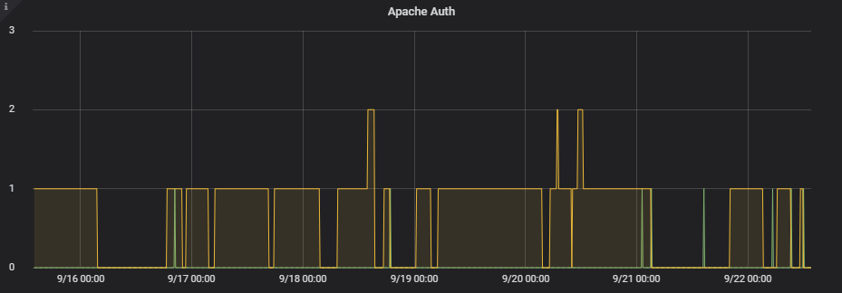

# fail2ban_exporter
Fail2ban exporter for [prometheus.io](https://prometheus.io).

## Requirements
- Python 3

## Installation
Run `install.sh` and fail2ban_exporter will be installed as a Systemd service.

## Enviroment variables
- **LISTEN_ADDRESS**. Default: `localhost`
- **LISTEN_PORT**. Default: `9180`
- **EXEC_PATH**. Default: `/usr/bin/`
